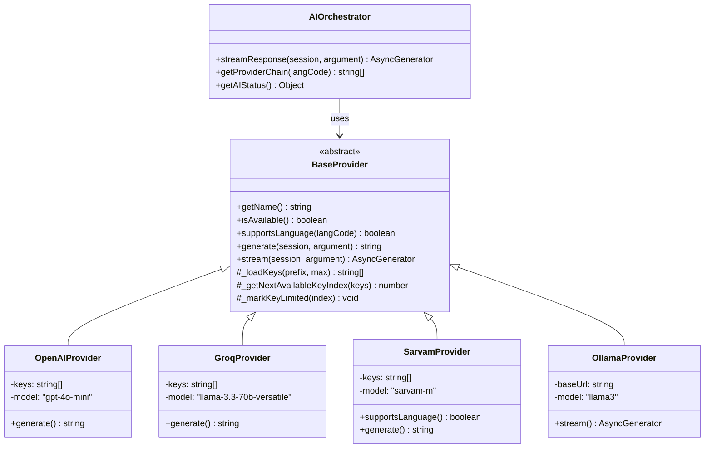
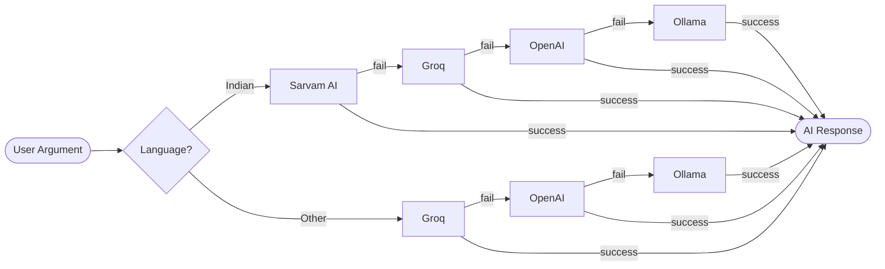
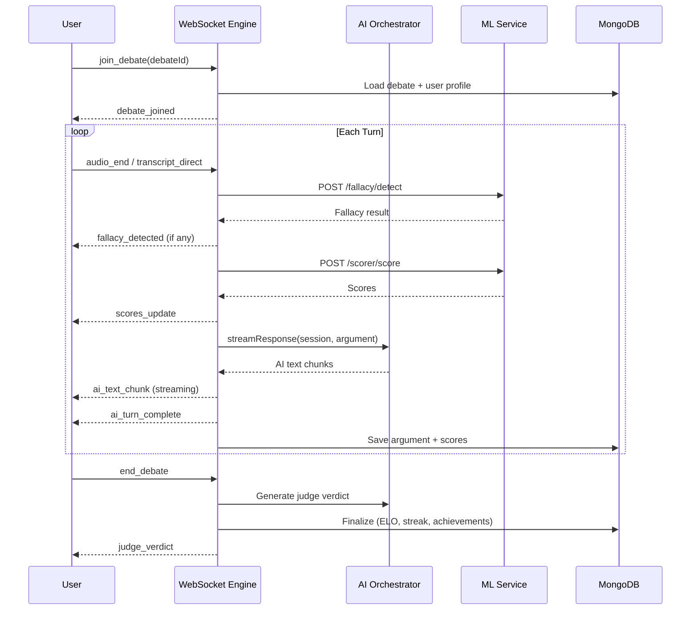
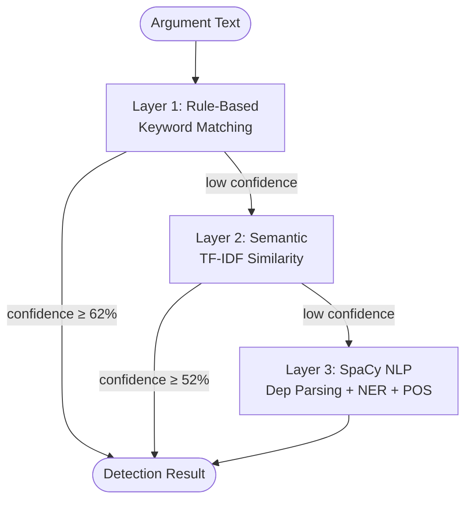
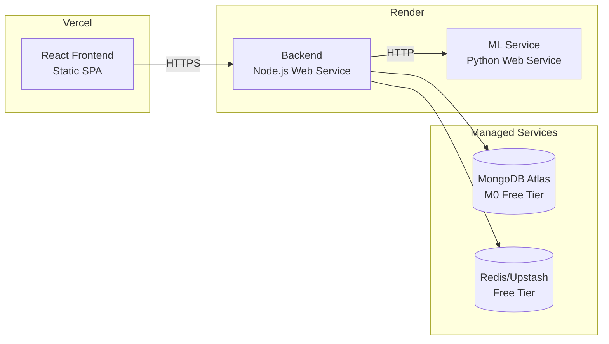

# DebateForge Architecture

## System Overview

DebateForge is a microservices-based AI debate platform with three primary services communicating via REST and WebSocket protocols.

```mermaid
graph TB
    subgraph "Frontend (Vercel)"
        FE[React SPA<br/>React 18 + Router v6]
    end

    subgraph "Backend (Render)"
        API[Express API Server]
        WS[WebSocket Engine<br/>Socket.IO]
        ORC[AI Orchestrator]
        
        subgraph "Providers"
            SAR[Sarvam AI<br/>Indian Languages]
            GRQ[Groq<br/>Llama 3.3 70B]
            OAI[OpenAI<br/>GPT-4o-mini]
            OLL[Ollama<br/>Local LLM]
        end
        
        subgraph "Services"
            DE[Debate Engine]
            SC[Scoring Service]
            FD[Fallacy Detection]
            TR[Translation]
            RK[Ranking/ELO]
            SS[Session Manager]
            AN[Analytics]
        end
    end

    subgraph "ML Service (Render)"
        FA[FastAPI Server]
        
        subgraph "NLP Stack"
            SP[SpaCy<br/>en_core_web_sm]
            NL[NLTK VADER<br/>Sentiment]
            TF[TF-IDF<br/>Embeddings]
        end
        
        subgraph "ML Routers"
            FLD[/fallacy/detect]
            SCS[/scorer/score]
            MEM[/memory/*]
            STT[/transcription/*]
        end
    end

    subgraph "Data Layer"
        MG[(MongoDB Atlas)]
        RD[(Redis/Upstash)]
        VS[(FAISS Vectors)]
    end

    FE <-->|REST + WebSocket| API
    FE <-->|Socket.IO| WS
    API --> ORC
    ORC --> SAR & GRQ & OAI & OLL
    WS --> DE & SC & FD
    SC --> FA
    FD --> FA
    API --> MG
    SS --> RD
    MEM --> VS
```

## AI Provider Architecture

The provider layer implements the **Strategy Pattern** for clean provider abstraction:



## Failover Chain



## WebSocket Debate Lifecycle



## ML Detection Pipeline



## Deployment Architecture



## Directory Structure

```
debateforge/
├── backend/
│   ├── config/          # Database, Redis, Swagger, constants
│   ├── controllers/     # Route handlers (auth, debate, profile, topics)
│   ├── middleware/       # Auth, rate limiting, bot defense
│   ├── models/          # Mongoose schemas (User, Debate, Topic)
│   ├── providers/       # AI provider abstraction (Strategy Pattern)
│   │   ├── base.provider.js
│   │   ├── openai.provider.js
│   │   ├── groq.provider.js
│   │   ├── sarvam.provider.js
│   │   └── ollama.provider.js
│   ├── routes/          # Express route definitions with Swagger docs
│   ├── services/        # Business logic layer
│   │   ├── aiOrchestrator.service.js
│   │   ├── debateEngine.service.js
│   │   ├── scoring.service.js
│   │   ├── fallacyDetection.service.js
│   │   ├── translation.service.js
│   │   ├── ranking.service.js
│   │   ├── session.service.js
│   │   └── analytics.service.js
│   ├── tests/           # Jest test suites
│   ├── websocket/       # Socket.IO real-time debate engine
│   └── server.js        # Express app entry point
├── frontend/
│   ├── src/
│   │   ├── components/  # Reusable UI components
│   │   ├── context/     # React context providers
│   │   ├── hooks/       # Custom hooks (useDebateSocket, useApi)
│   │   ├── pages/       # Route-level page components
│   │   └── styles/      # CSS design system
│   └── public/
├── ml/
│   ├── routers/         # FastAPI endpoints (fallacy, scorer, memory, transcription)
│   ├── services/        # ML service logic (whisper, TTS)
│   ├── models/          # Model store and embeddings
│   ├── pipelines/       # NLP pipelines (language detection, translation)
│   ├── utils/           # Shared utilities (text processing, embeddings)
│   └── tests/           # pytest test suite
├── .github/
│   ├── workflows/ci.yml # GitHub Actions CI pipeline
│   └── dependabot.yml   # Automated dependency updates
├── ARCHITECTURE.md      # This file
├── API_DOCS.md          # REST + WebSocket API documentation
├── ROADMAP.md           # Feature roadmap
└── README.md            # Project overview
```
